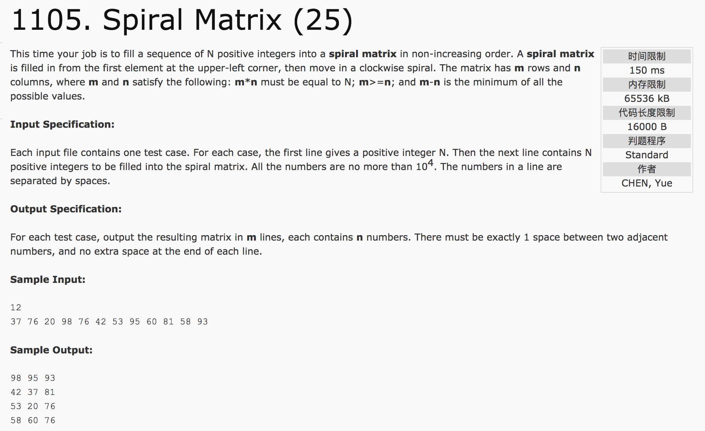

## Spiral Matrix(25)



题意：

分析：

1）当偶数行时，在m/2行结束；当奇数行时，m/2 + m%2行结束。

2）每循环一次，数据的起始地址为[i][j]，即左上角地址。因此，循环一次，将数据分成四段分别赋值(向右，向下，向左，向上)

向右：行不变，列变化。行为 i，列为 i 至 n-1-i;

向下：列不变，行变化。行为 i+1 至 m-1-(i+1)，列为 n-1-i;

向左：行不变，列变化。行为 m-1-i, 列为 n-1-i 至 i;

向上：列不变，行变化。行为 m-1-(i+1) 至 i+1, 列为 i;

**无论怎样变化，要保证总行数为m, 总列数为n。**

c++代码：

```c++
#include <cstdio>
#include <algorithm>
#include <cmath>
#include <vector>
using namespace std;
int getn(int num) {
  int n = sqrt(num * 1.0);
  while(num % n != 0) {
    n--;
  }
  return n;
}
bool cmp(int a, int b) {
  return a > b;
}
int main() {
  int N, m, n;
  vector<int> v;
  scanf("%d", &N);
  v.resize(N);
  for(int i = 0; i < N; i++)
    scanf("%d", &v[i]);
  sort(v.begin(), v.end(), cmp);
  n = getn(N);  //列
  m = N / n;  //行
  int ans[m][n];
  int t = 0;
  for(int i = 0; i < (m / 2 + m % 2); i++) {
    for(int j = i; j <= n - 1 - i && t <= N - 1; j++)
      ans[i][j] = v[t++];
    for(int j = i + 1; j <= m - 2 - i && t <= N - 1; j++)
      ans[j][n - i - 1] = v[t++];
    for(int j = n - i - 1; j >= i && t <= N - 1; j--)
      ans[m - i - 1][j] = v[t++];
    for(int j = m - i - 2; j >= i + 1 && t <= N - 1; j--)
      ans[j][i] = v[t++];
  }
  for(int i = 0; i < m; i++) {
    for(int j = 0; j < n; j++) {
      if(j == 0)
        printf("%d", ans[i][j]);
      else
        printf(" %d", ans[i][j]);
    }
    printf("\n");
  }
  return 0;
}
```
