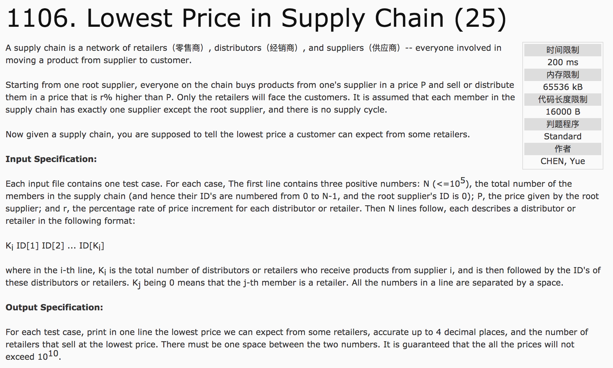
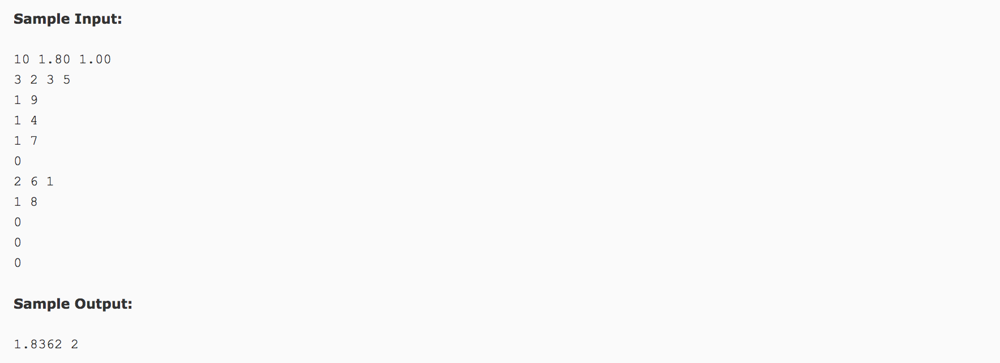

## Lowest Price in Supply Chain(25)




题意：给定一棵树，求其深度的最小值及其满足深度最小值的叶子结点的个数。

分析：

1）深度优先搜索，vector<int>对象。

2）深度优先搜索函数中，先判断深度大小课节省时间。

c++代码(subond):

```c++
#include <cstdio>
#include <vector>
#include <cmath>
using namespace std;
vector<int> v[100005];
vector<int> path;
int mindepth = 99999999;
int count = 1;
double p, r;
void dfs(int x, int depth) {
  //path.push_back(x);
  //为了避免超时，先比较depth
  if(mindepth < depth)
    return ;
  if(v[x].size() == 0) {
    if(mindepth == depth)
      count++;
    if(mindepth > depth) {
      mindepth = depth;
      count = 1;
    }
    return ;
  }
  for(int i = 0; i < v[x].size(); i++)
    dfs(v[x][i], depth + 1);
}
int main() {
  int n, k, temp;
  scanf("%d %lf %lf", &n, &p, &r);
  for(int i = 0; i < n; i++) {
    scanf("%d", &k);
    for(int j = 0; j < k; j++) {
      scanf("%d", &temp);
      v[i].push_back(temp);
    }
  }
  dfs(0, 0);
  printf("%.4f %d", p * pow(1 + r/100, mindepth), count);
  return 0;
}
```
