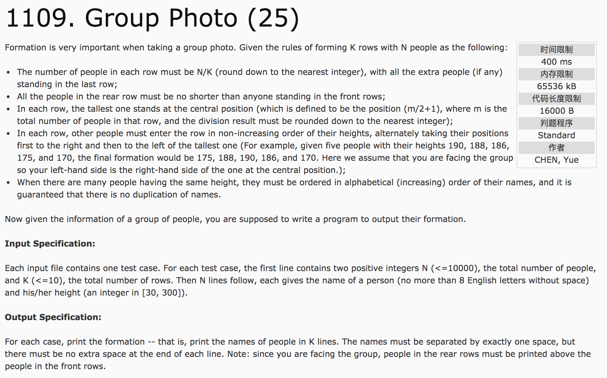
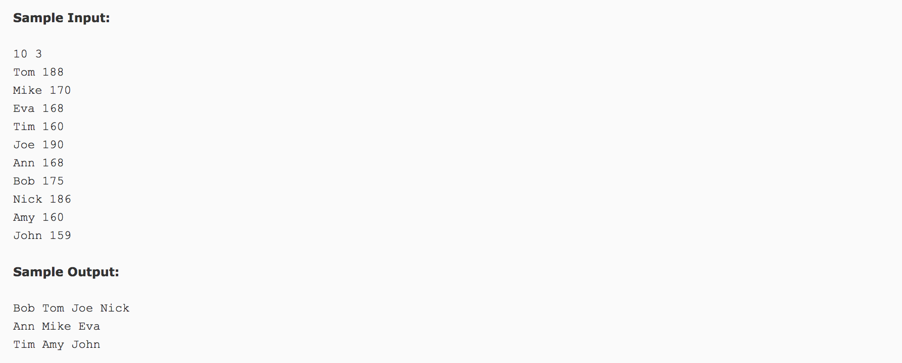

## Group Photo(25)




c++代码：

```c++
#include <iostream>
#include <string>
#include <algorithm>
using namespace std;
struct node {
  int height;
  string name;
};
bool cmp(node a, node b) {
  //排序函数，可以由多层结构组成，按优先顺序
  if(a.height != b.height) {
    return a.height > b.height;
  } else {
    return a.name < b.name;
  }
}
int main() {
  int n, k, m;
  cin >> n >> k;
  struct node *stu = new struct node[n];
  int i, j;
  for(int i = 0; i < n; i++) {
    cin >> stu[i].name;
    cin >> stu[i].height;
  }
  sort(stu, stu + n, cmp);
  int t = 0;
  int row = k;
  while(row) {
    if(row == k)
      m = n - n / k * (k - 1);
    else
      m = n / k;
    string *stemp = new string [m];
    stemp[m / 2] = stu[t].name;
    //左
    j = m / 2 - 1;
    for(i = t + 1; i < t + m; i = i + 2)
      stemp[j--] = stu[i].name;
    //右
    j = m / 2 + 1;
    for(i = t + 2; i < t + m; i = i + 2)
      stemp[j++] = stu[i].name;
    //当前排
    cout << stemp[0];
    for(i = 1; i < m; i++)
      cout << " " << stemp[i];
    cout << endl;
    t = t + m;
    row--;
    delete [] stemp;
  }
  delete [] stu;
  return 0;
}
```
