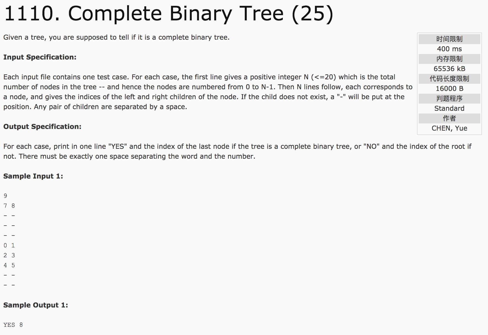
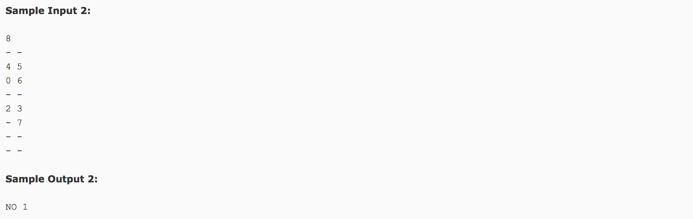

## Complete Binary Tree(25)




题意：判断一棵树是否为完全二叉树。

分析：

1）字符串的输入，如何判断并转化为数字。char s[3], s[0] - '0', strlen(s)。

2）利用queue对象，进行广度优先搜索。

```c++
#include <cstdio>
#include <queue>
using namespace std;
struct node {
  int left, right;
};
int count = 0, lastnode = 0;
vector<node> v;  //存放结点信息，无子结点时写入-1，root为其根结点
//queue广度优先搜索
queue<int> q;
q.push(root);
while(!q.empty()) {
  int node = q.front();
  q.pop();
  if(node != -1) {
    lastnode = node;
    count++;
  } else {
    if(count != n)
      printf("NO %d", root);
    else
      printf("YES %d", lastnode);
  }
  q.push(v[node].left);
  q.push(v[node].right);
}
```

c++代码(subond&):

```c++
#include <iostream>
#include <cstring>
#include <vector>
#include <queue>
using namespace std;
struct node {
  int left;
  int right;
};
int main() {
  int n, root = 0;
  scanf("%d", &n);
  char a[3], b[3];
  vector<node> v(n);
  int book[n] = {0};
  for(int i = 0; i < n; i++) {
    scanf("%s %s", a, b);
    if(a[0] == '-')
      v[i].left = -1;
    else {
      int temp = a[0] - '0';
      if(strlen(a) == 2) {
        temp = temp * 10 + (a[1] - '0');
      }
      v[i].left = temp;
      book[temp] = 1;
    }
    if(b[0] == '-')
      v[i].right = -1;
    else {
      int temp = b[0] - '0';
      if(strlen(b) == 2) {
        temp = temp * 10 + (b[1] - '0');
      }
      v[i].right = temp;
      book[temp] = 1;
    }
    //if(v[i].left != -1)
    //  book[v[i].left] = 1;
    //if(v[i].right != -1)
    //  book[v[i].right] = 1;
  }
  for(int i = 0; i < n; i++) {
    if(book[i] == 0) {
      root = i;
      break;
    }
  }
  queue<int> q;
  q.push(root);
  int t = 0;
  int lastnode = 0;
  while(!q.empty()) {
    int node = q.front();
    q.pop();
    if(node != -1) {
      lastnode = node;
      t++;
    } else {
      if(t != n)
        printf("NO %d", root);
      else
        printf("YES %d", lastnode);
      return 0;
    }
    q.push(v[node].left);
    q.push(v[node].right);
  }
  return 0;
}
```
