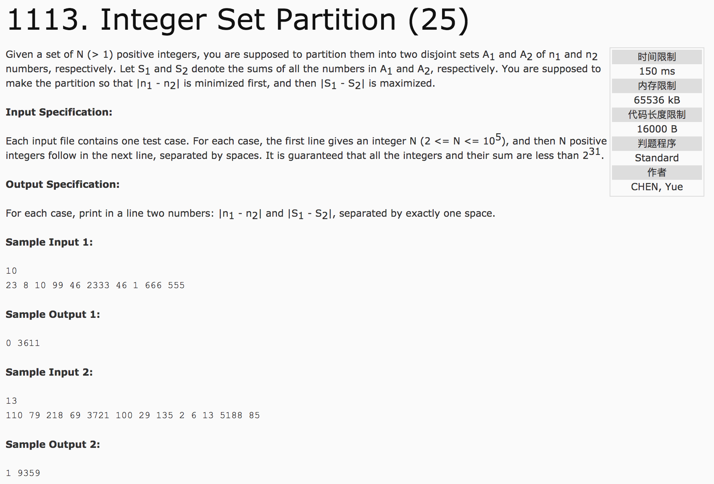

## Integer Set Partition(25)



题意：把一个集合分成两个不相交的集合，使得这两个集合的元素个数相差最小的前提下，两个集合的总和之差最大。

分析：n % 2即为元素个数相差，总和之差为sum - 2 * halfsum(halfsum计算至n/2)。

c++代码：

```c++
#include <cstdio>
#include <algorithm>
#include <vector>
using namespace std;
int main() {
  int n, sum = 0, halfsum = 0;
  scanf("%d",&n);
  vector<int> v(n);
  for(int i = 0; i < n; i++) {
    scanf("%d", &v[i]);
    sum += v[i];
  }
  sort(v.begin(), v.end());
  for(int i = 0; i < n / 2; i++)
    halfsum += v[i];
  printf("%d %d", n % 2, sum - 2 * halfsum);
  return 0;
}
```
