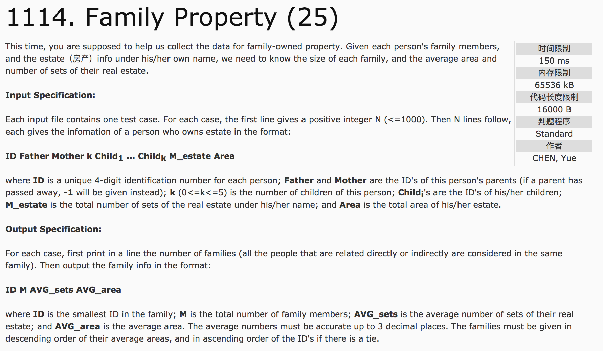
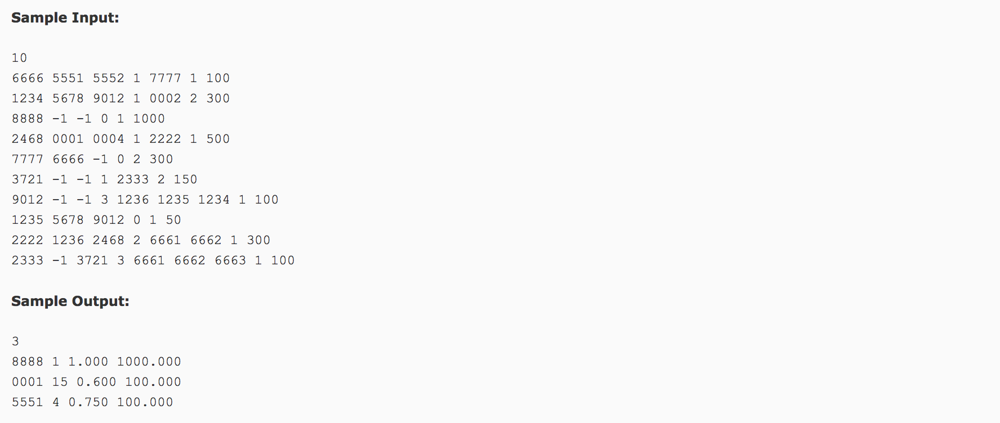

## Family Property(25)




题意：**并查集**。给定每个家庭的成员信息及其房产，统计出每个家庭的人口数，人均房产面积和套数。

输出信息时，家庭成员的最小编号 人口数 人均房产面积 人均房产套数(人均值保留小数点后3位)。家庭信息首先按人均面积降序输出，若有并列，按成员编号升序输出。

分析：

1）结构体数组，保存每个成员信息和每个家庭信息。

```c++
//保存每个成员信息
struct DATA {
  int id, fid, mid, num, area;
  int child[6];
};
//保存家庭信息
struct node {
  int id, people;
  double num, area;
  bool flag = false;
};
```

2）并查集操作。第一，寻找父结点(初始化时，每个结点的父节点是其本身)。第二，合并父结点(应该注意如何合并)。通常，结合visit[n]={false}使用。

```c++
int father[n];
for(int i = 0; i < n; i++)
  father[i] = i;
int findfather(int x) {
  while(x != father[x])
    x = father[x];
  return x;
}
void Union(int a, int b) {
  int faA = findfather(a);
  int faB = findfather(b);
  if(faA <= faB)
    father[b] = faA;
  else
    father[a] = faB;
}
```

c++代码：

```c++
#include <cstdio>
#include <algorithm>
using namespace std;
struct DATA {
  int id, fid, mid, num, area;
  int child[10];
}data[1005];
struct node {
  int id, people;
  double num, area;
  bool flag = false;
}ans[10000];
int father[10000];
bool visit[10000];
int findfather(int x) {
  while(x != father[x])
    x = father[x];
  return x;
}
void Union(int a, int b) {
  int faA = findfather(a);
  int faB = findfather(b);
  if(faA > faB)
    father[faA] = faB;
  else if(faA < faB)
    father[faB] = faA;
}
bool cmp(node a, node b) {
  if(a.area != b.area)
    return a.area > b.area;
  else
    return a.id < b.id;
}
int main() {
  int n, k, count = 0;
  scanf("%d", &n);
  for(int i = 0; i < 10000; i++)
    father[i] = i;
  for(int i = 0; i < n; i++) {
    scanf("%d %d %d %d", &data[i].id, &data[i].fid, &data[i].mid, &k);
    visit[data[i].id] = true;
    if(data[i].fid != -1) {
      visit[data[i].fid] = true;
      Union(data[i].fid, data[i].id);
    }
    if(data[i].mid != -1) {
      visit[data[i].mid] = true;
      Union(data[i].mid, data[i].id);
    }
    for(int j = 0; j < k; j++) {
      scanf("%d", &data[i].child[j]);
      visit[data[i].child[j]] = true;
      Union(data[i].id, data[i].child[j]);
    }
    scanf("%d %d", &data[i].num, &data[i].area);
  }
  for(int i = 0; i < n; i++) {
    int id = findfather(data[i].id);
    ans[id].id = id;
    ans[id].num += data[i].num;
    ans[id].area += data[i].area;
    ans[id].flag = true;
  }
  for(int i = 0; i < 10000; i++) {
    if(visit[i])
      ans[findfather(i)].people++;
    if(ans[i].flag)
      count++;
  }
  for(int i = 0; i < 10000; i++) {
    if(ans[i].flag) {
      ans[i].num = (double)(ans[i].num * 1.0 / ans[i].people);
      ans[i].area = (double)(ans[i].area * 1.0 / ans[i].people);
    }
  }
  sort(ans, ans + 10000, cmp);
  printf("%d\n", count);
  for(int i = 0; i < count; i++) {
    printf("%04d %d %.3f %.3f\n", ans[i].id, ans[i].people, ans[i].num, ans[i].area);
  }
  return 0;
}
```
