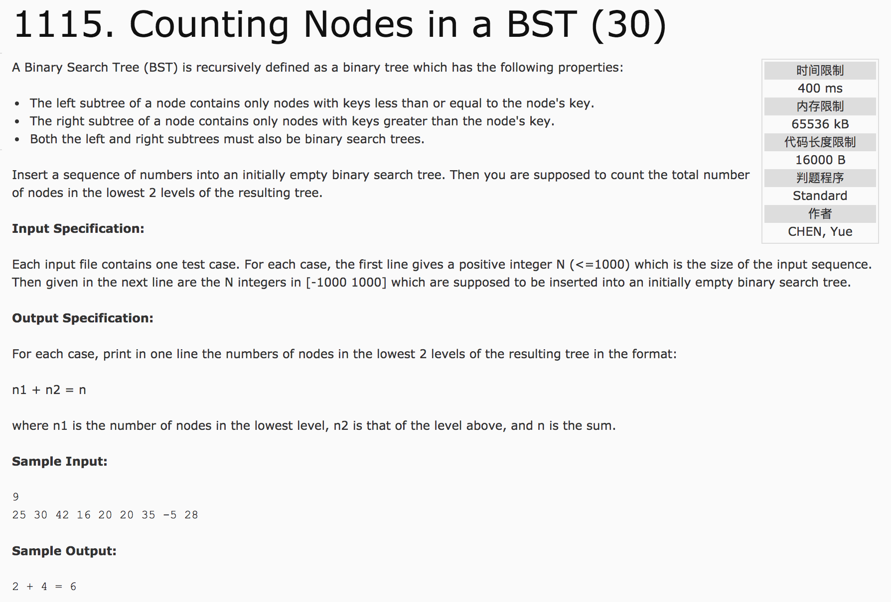

## Counting Nodes in a Best



题意：给定一组序列，用这组序列构建二叉搜索树，输出这棵树的最后两层的结点个数及其和，格式为“a + b = c”。

分析：

1）利用链表存储数据，递归构建二搜索叉树。

2) 深度优先搜索。当结点为NULL时，更新maxdepth。用数组存储每层结点个数，输出数组的最好两个值即可。

```c++
#include <cstdio>
using namespace std;
struct TREE {
  int value;
  struct TREE *left, *right;
};
TREE* insert(TREE *tree, int value) {
  if(tree == NULL) {
    tree = new struct TREE();
    tree->value = value;
    tree->left = tree->right = NULL;
    return tree;
  }
  if(value <= tree->value)
    tree->left = insert(tree->left, value);
  if(value > tree->value)
    tree->right = insert(tree->right, value);
  return tree;
}
```

c++代码(subond&):

```
#include <cstdio>
#include <vector>
#include <algorithm>
using namespace std;
vector<int> v(1000);
int maxdepth = -1;
struct TREE {
  int value;
  struct TREE *left, *right;
};
struct TREE* insert(struct TREE *tree, int value) {
  if(tree == NULL) {
    tree = new struct TREE();
    tree->value = value;
    tree->left = tree->right = NULL;
    return tree;
  }
  if(value <= tree->value)
    tree->left = insert(tree->left, value);
  if(value > tree->value)
    tree->right = insert(tree->right, value);
  return tree;
}
void dfs(struct TREE *tree, int depth) {
  if(tree == NULL) {
    maxdepth = max(depth, maxdepth);
    return;
  }
  v[depth]++;
  dfs(tree->left, depth + 1);
  dfs(tree->right, depth + 1);
}
int main() {
  int n, temp;
  scanf("%d", &n);
  if(n == 0) {
    printf("0");
  }
  struct TREE *tree = NULL;
  for(int i = 0; i < n; i++) {
    scanf("%d", &temp);
    tree = insert(tree, temp);
  }
  dfs(tree, 0);
  printf("%d + %d = %d", v[maxdepth - 1], v[maxdepth - 2], v[maxdepth - 1] + v[maxdepth - 2]);
  return 0;
}
```
