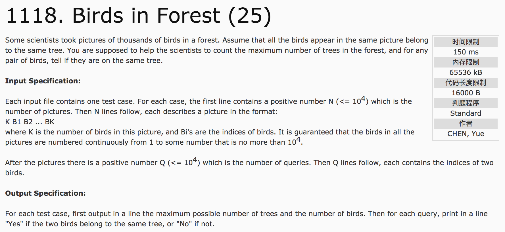
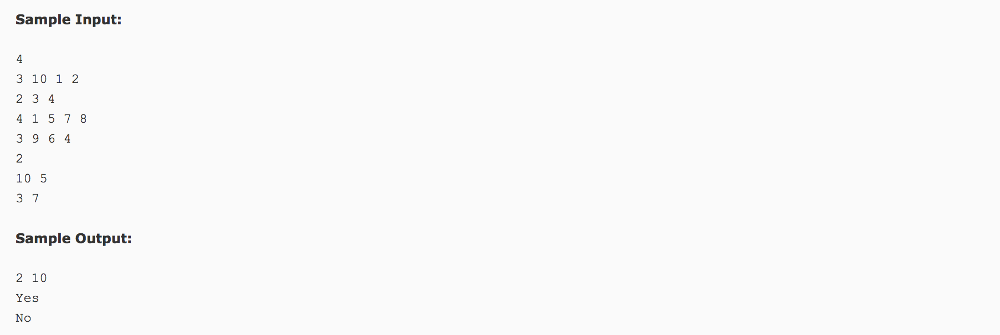

## Birds in Forest(25)




题意：有n幅画，一幅画里面的鸟为同一颗树上的，求有几棵树，几只鸟，并判断任意两只鸟是否在同一棵树上。

分析：

1）用鸟的标识记录的树的情况。令father[i]数组，表示鸟i在树father[i]上。对于初始情况，father[i]=i。

2）exist[i]表示鸟的出现情况，便于计算鸟的数量。

3）在数据存储时，可以把每一幅图中的第一只鸟father[i]作为树的标识，对其后的鸟均将其father的值变更为第一只鸟的father值。这样，在计算树的数量时，只要判断father[i] = i，相等则为一棵树。注意：**其起始值为1，终值为鸟的数量**。

c++代码：

```c++
#include <cstdio>
#include <algorithm>
using namespace std;
const int maxn = 100010;
bool exist[maxn] = {false};
int n, k, q;
int father[maxn];
int findfather(int x) {
  if(x == father[x]) {
    return x;
  } else {
    int f = findfather(father[x]);
    father[x] = f;
    return f;
  }
}
int main() {
  for(int i = 1; i <= maxn; i++)
    father[i] = i;  //鸟i属于树father[i]
  scanf("%d", &n);
  int count = 0, tree = 0, temp;
  for(int i = 0; i < n; i++) {
    int bf;
    scanf("%d", &k);
    for(int j = 0; j < k; j++) {
      scanf("%d", &temp);
      if(!exist[temp]) {
        count++;
        exist[temp] = true;
      }
      if(j == 0) {
        bf = findfather(temp);
      } else {
        if(findfather(temp) != bf);
          father[findfather(temp)] = bf;
      }
    }
  }
  for(int i = 1; i <= count; i++) {
    if(father[i] == i)
      tree++;
  }
  printf("%d %d\n", tree, count);
  scanf("%d", &q);
  for(int i = 0; i < q; i++) {
    int a, b;
    scanf("%d %d", &a, &b);
    if(findfather(a) == findfather(b))
      printf("Yes\n");
    else
      printf("No\n");
  }
  return 0;
}
```
