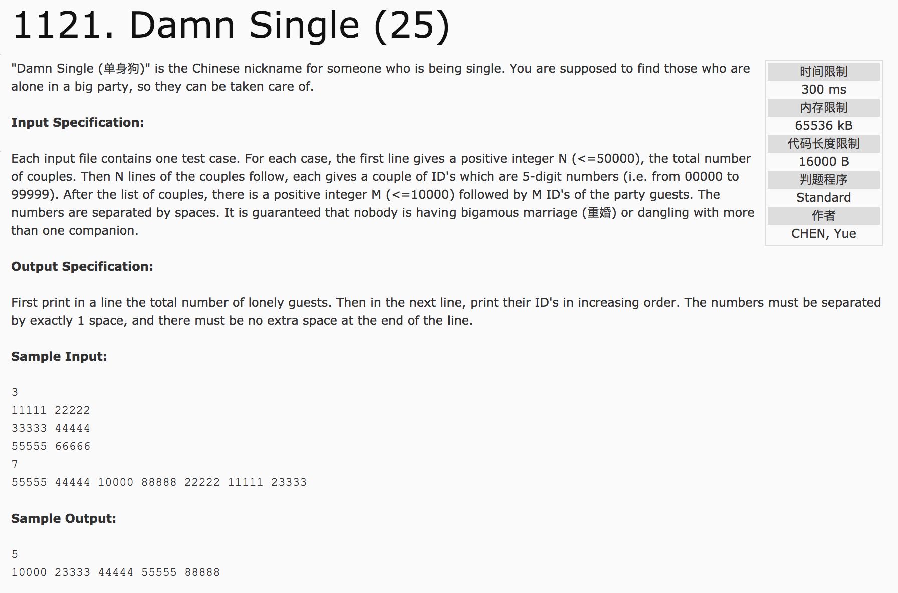

## Damn Single(25)



题意：给定情侣关系的对应表(数字)，在指定的序列中出去情侣，并按id从小到大输出。

分析：

1）结构体数组，保存数据时将较小的id放在同一位置，便于排序。

[运行超时版](cppfiles/1121.cpp)

2）使用set对象。visit[i]表示表示对象存在

c++代码：

```c++
#include <cstdio>
#include <set>
#include <vector>
using namespace std;
int main() {
  int n, m, a, b;
  scanf("%d", &n);
  vector<int> couple(100000, -1);
  for(int i = 0; i < n; i++) {
    scanf("%d %d", &a, &b);
    couple[a] = b;
    couple[b] = a;
  }
  scanf("%d", &m);
  vector<int> guest(m);
  int visit[100000] = {0};
  for(int i = 0; i < m; i++) {
    scanf("%d", &guest[i]);
    if(couple[guest[i]] != -1) {
      visit[guest[i]] = 1;
    }
  }
  set<int> s;
  for(int i = 0; i < m; i++) {
    if(!visit[guest[i]])
      s.insert(guest[i]);
  }
  printf("%d\n", s.size());
  for(set<int>::iterator it = s.begin(); it != s.end(); it++) {
    if(it != s.begin())
      printf(" ");
    printf("%05d", *it);
  }
  return 0;
}
```
