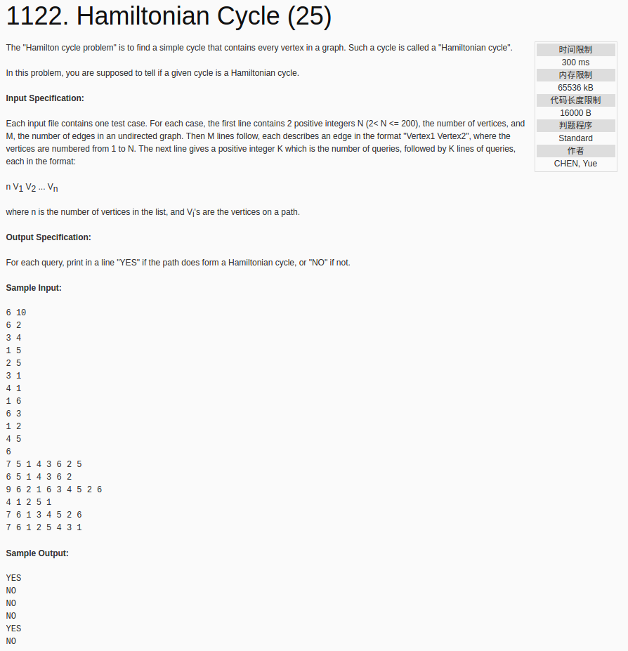

## Hamiltonian Cycle(25)



分析：

1）使用set判断结点的唯一性。

2）图论，连通。

c++代码：

```c++
#include <cstdio>
#include <algorithm>
#include <set>
using namespace std;
const int inf = 99999999;
int e[210][210];
int temp[210];
int main() {
  int N, M, a, b, n, k;
  scanf("%d %d", &N, &M);
  fill(e[0], e[0] + 210 * 210, inf);
  for(int i = 0; i < M; i++) {
    scanf("%d %d", &a, &b);
    e[a][b] = 1;
    e[b][a] = 1;
  }
  scanf("%d", &n);
  set<int> s;
  for(int i = 0; i < n; i++) {
    scanf("%d", &k);
    for(int j = 0; j < k; j++) {
      scanf("%d", &temp[j]);
      s.insert(temp[j]);
    }
    if(k != N + 1 || s.size() != N)
      printf("NO\n");
    else {
      int l;
      if(k == N + 1 && s.size() == N) {
        for(l = 0; l < k - 1; l++) {
          if(e[temp[l]][temp[l + 1]] == 1 && temp[0] == temp[k - 1])
            continue;
          else {
            printf("NO\n");
            break;
          }
        }
        if(l == k - 1)
          printf("YES\n");
      }
    }
    s.clear();
  }
  return 0;
}
```
