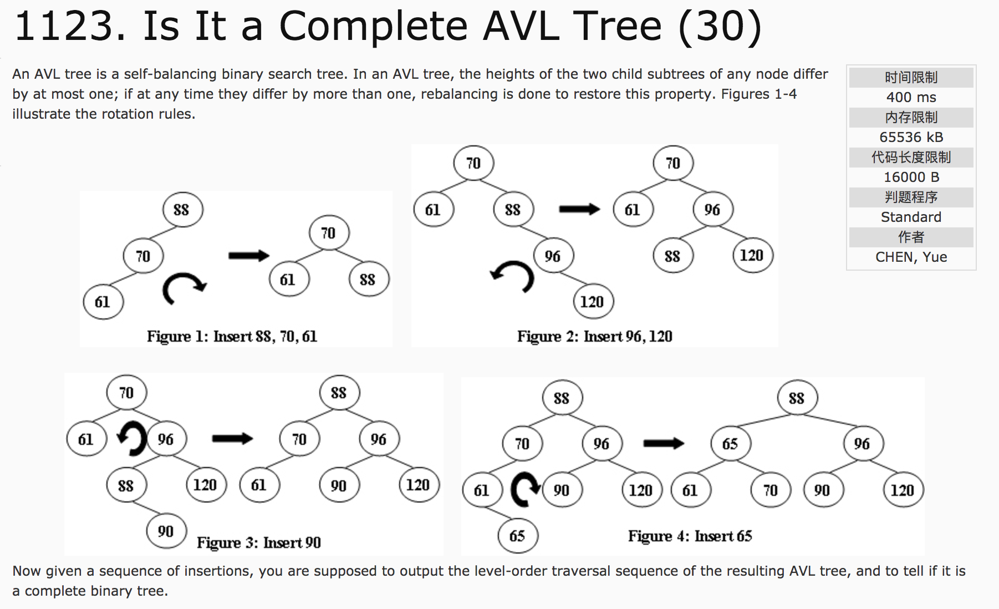
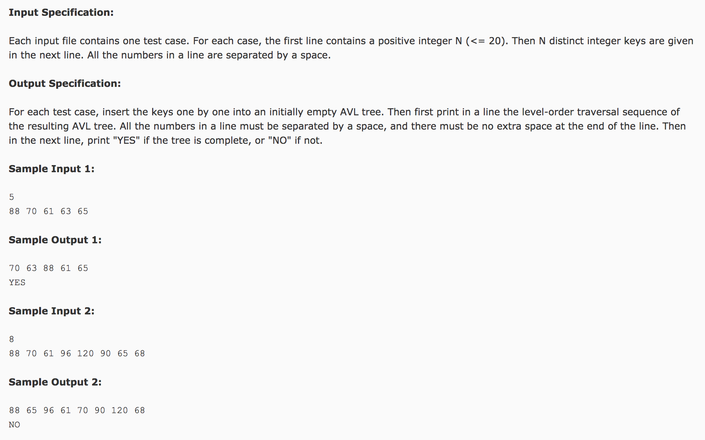

## Is it a Complete AVL Tree(30)




题意：考察AVL树和层序遍历。AVL树本质上是一棵二叉搜索树，但是带有平衡条件。

分析：

1）判断是不是完全二叉树。如果在出现了一个孩子为空的结点后，又出现孩子结点不为空的结点，则不是完全二叉树。

2）AVL树的四种情况。令发现树不平衡的点，称为A点。用三个点举例，形象易懂。

则发现树不平衡的四种情况为：

新来的结点插入到A的左子树的左子树；  需要右旋一次  
新来的结点插入到A的左子树的右子树；  需要先左旋(tree->left)一次，再右旋一次
新来的结点插入到A的右子树的左子树；  先右旋(tree->right)一次，再左旋一次
新来的结点插入到A的右子树的右子树；  需要左旋一次  

c++代码：

```c++
#include <cstdio>
#include <vector>
#include <queue>
using namespace std;
struct Node {
  int value;
  struct Node *left, *right;
};
struct Node* leftRotate(struct Node *tree) {
  struct Node *temp = tree->right;
  tree->right = temp->left;
  temp->left = tree;
  return temp;
}
struct Node* rightRotate(struct Node *tree) {
  struct Node *temp = tree->left;
  tree->left = temp->right;
  temp->right = tree;
  return temp;
}
struct Node* leftrightRotate(struct Node *tree) {
  tree->left = leftRotate(tree->left);
  tree = rightRotate(tree);
  return tree;
}
struct Node* rightleftRotate(struct Node *tree) {
  tree->right = rightRotate(tree->right);
  tree = leftRotate(tree);
  return tree;
}
int getHeight(struct Node *tree) {
  if(tree == NULL) {
    return 0;
  } else {
    int l = getHeight(tree->left);
    int r = getHeight(tree->right);
    return l > r ? l + 1 : r + 1;
  }
}
struct Node* insert(struct Node *tree, int value) {
  if(tree == NULL) {
    tree = new struct Node();
    tree->value = value;
    return tree;
  }
  if(value < tree->value) {
    tree->left = insert(tree->left, value);
    int l = getHeight(tree->left);
    int r = getHeight(tree->right);
    if(l - r >= 2) {
      if(value < tree->left->value)
        tree = rightRotate(tree);
      else
        tree = leftrightRotate(tree);
    }
  }
  else {
    tree->right = insert(tree->right, value);
    int l = getHeight(tree->left);
    int r = getHeight(tree->right);
    if(r - l >= 2) {
      if(value < tree->right->value)
        tree = rightleftRotate(tree);
      else
        tree = leftRotate(tree);
    }
  }
  return tree;
}
int isComplete = 1, after = 0;
vector<int> levelOrder(struct Node *tree) {
  vector<int> v;
  queue<struct Node *> q;
  q.push(tree);
  while(!q.empty()) {
    struct Node *temp = q.front();
    q.pop();
    v.push_back(temp->value);
    if(temp->left != NULL) {
      if(after) {
        isComplete = 0;
      }
      q.push(temp->left);
    } else {
      after = 1;
    }
    if(temp->right != NULL) {
      if(after) {
        isComplete = 0;
      }
      q.push(temp->right);
    } else {
      after = 1;
    }
  }
  return v;
}
void print(vector<int> v) {
  for(int i = 0; i < v.size(); i++) {
    if(i == 0)
      printf("%d", v[i]);
    else
      printf(" %d", v[i]);
  }
  printf("\n");
}
int main() {
  int n;
  scanf("%d", &n);
  struct Node *tree = NULL;
  for(int i = 0; i < n; i++) {
    int temp = 0;
    scanf("%d", &temp);
    tree = insert(tree, temp);
  }
  vector<int> v = levelOrder(tree);
  print(v);
  if(isComplete)
    printf("YES");
  else
    printf("NO");
  return 0;
}
```
